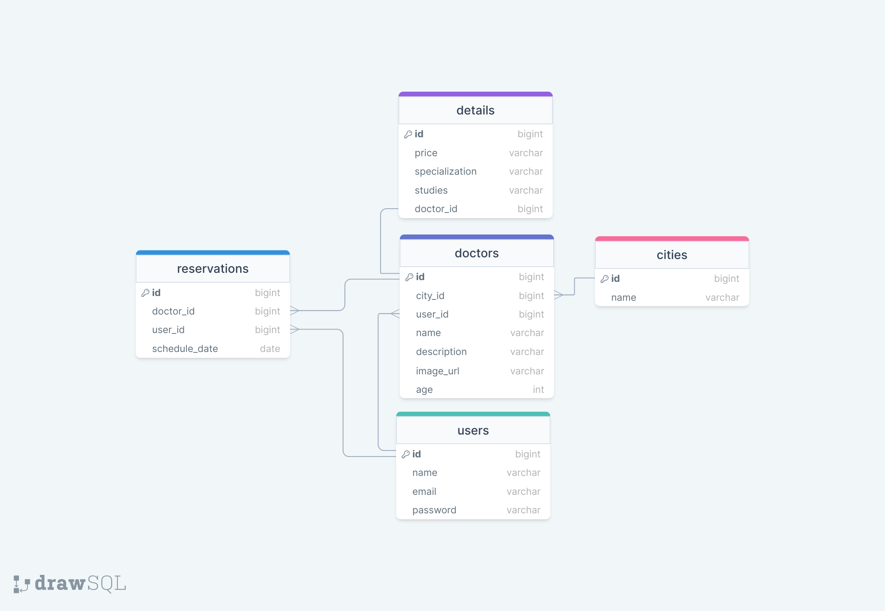

<div align="center">

<a name="readme-top"></a>

  <h3><b>Final Capstone Project Back End</b></h3>

</div>

# 📗 Table of Contents

- [📗 Table of Contents](#-table-of-contents)
- [📖 final\_capstone\_back\_end ](#-final_capstone_back_end-)
  - [🛠 ER Diagram ](#-er-diagram-)
  - [💻 link to front end ](#-link-to-front-end-)
  - [💻 link to Kanban board information ](#-link-to-kanban-board-information-)
  - [🛠 Built With ](#-built-with-)
    - [Tech Stack ](#tech-stack-)
    - [Key Features ](#key-features-)
  - [💻 Getting Started ](#-getting-started-)
    - [Prerequisites](#prerequisites)
    - [Setup](#setup)
    - [Install](#install)
    - [Database Setup](#database-setup)
    - [Usage](#usage)
  - [💻 Tests ](#tests-)
  - [👥 Authors ](#-authors-)
  - [🔭 Future Features ](#-future-features-)
  - [🤝 Contributing ](#-contributing-)
  - [⭐️ Show your support ](#️-show-your-support-)
  - [🙏 Acknowledgments ](#-acknowledgments-)
  - [❓ FAQ (OPTIONAL) ](#-faq-optional-)
  - [📝 License ](#-license-)


# 📖 Final Capstone Back End <a name="about-project"></a>

**final_capstone_back_end** The back-end component of this final capstone project is developed using Ruby on Rails, configured to serve as an API. This API is designed to facilitate medical appointments, and to allow users to make reservations for doctors. It leverages a PostgreSQL database to manage and store reservation data. The API is designed to be consumed by a front-end application, which is developed using React.js.

## 🛠 ER Diagram <a name="built-with"></a>

Model diagram



<p align="right">(<a href="#readme-top">back to top</a>)</p>

## 💻 Link to front end <a name="built-with"></a>


[Link to Front End](https://github.com/EvansSnave/final-capstone-project-front-end)

<p align="right">(<a href="#readme-top">back to top</a>)</p>

## 💻 link to Kanban board information <a name="built-with"></a>

[Link to Kanban Board](https://github.com/EvansSnave/final-capstone-project-back-end/projects/1)

[Initial state](https://github.com/EvansSnave/final-capstone-project-front-end/issues/17)

This project was completed by two Team members:

- Kevin Cruz
- Fisayo Michael

<p align="right">(<a href="#readme-top">back to top</a>)</p>

## 🛠 Built With <a name="built-with"></a>

### Tech Stack <a name="tech-stack"></a>

<details>
  <summary>Technologies</summary>
  <ul>
    <li><a href="https://rubyonrails.org/">Ruby on Rails</a></li>
  </ul>
</details>
<details>
<summary>Linters</summary>
  <ul>
    <li>Rubocop</li>
  </ul>
</details>


### Key Features <a name="key-features"></a>

- **Ruby on Rails**
- **API Endpoint**
- **Professional Documentation**
- **Linting for Code Quality**
- **Postgres Database**
- **Git Version Control**


<p align="right">(<a href="#readme-top">back to top</a>)</p>


## 💻 Getting Started <a name="getting-started"></a>

To get a local copy up and running, follow these steps:

### Prerequisites

Before you begin, ensure you have the following prerequisites installed on your system:

- Ruby: You need Ruby to run the Ruby on Rails application.
- Bundler: Bundler is used to manage gem dependencies for your Ruby project.

### Setup

In your terminal, navigate to the folder of your choice and clone the repository with the following commands:

```sh
cd my-folder
git https://github.com/EvansSnave/final-capstone-project-back-end.git

```

### Install

After cloning the project, change into the project directory:

```sh
cd final_capstone_project_back_end

```

Install this project with:

- gem install rails
- bundle install

### Credentials setup
In order to create databases and run the tests, you need to follow this steps:
1. Remove config/master.key and config/credentials.yml.enc if they exist.
2. Run `rails secret`. This will generate a key. Copy and reserve the key to use later.
3. If you use Windows run: `$env:EDITOR="code --wait"; rails credentials:edit` If you use Linux run: `EDITOR="code --wait" bin/rails credentials:edit`
4. Your editor will open a file, add at the bottom `devise_jwt_secret_key: <the key you copied in step 2>`
5. Save the file and close the editor.  New master.key, credentials.yml.enc files will be generated, and the key will be stored in `Rails.application.credentials.devise_jwt_secret_key`.

### Database Setup

Create and migrate your database with:

```sh

rails db:create
rails db:migrate
rails db:seed

```
### Usage

To run the project, execute the following command:

```sh

rails server
or
rails s

```
This should start your local server on http://localhost:3000/. Now, you can use the REST API client of your choice to interact with the API.

<p align="right">(<a href="#readme-top">back to top</a>)</p>

## Tests <a name="tests"></a>

To run tests, navigate to the directory where the project is located on your machine, open your terminal, and follow these steps:

Test Suite
This project contains a suite of unit tests which you can run to ensure everything is functioning as expected. To run these tests, you need RSpec installed.

To install RSpec if you haven't already, run:

gem install rspec
After you've installed RSpec, you can run the tests with:

bundle exec rspec spec/controllers
bundle exec rspec spec/models

<p align="right">(<a href="#readme-top">back to top</a>)</p>

## 👥 Authors <a name="authors"></a>

👤 **EvanSnave**

- GitHub: [EvansSnave](https://github.com/EvansSnave)
- Twitter: [Kroja13](https://twitter.com/Kroja13)
- LinkedIn: [Kevin Cruz](https://www.linkedin.com/in/kevin-cruz-25159a201/)

👤 **Fisayo Michael**

- GitHub: [fmanimashaun](https://github.com/fmanimashaun)
- Twitter: [@fmanimashaun](https://twitter.com/fmanimashaun)
- LinkedIn: [fmanimashaun](https://www.linkedin.com/in/fmanimashaun/)

<p align="right">(<a href="#readme-top">back to top</a>)</p>


## 🔭 Future Features <a name="future-features"></a>

- [ ] **Implement proper user authentication from the front-end to the server**
- [ ] **Add authorizations to users**


<p align="right">(<a href="#readme-top">back to top</a>)</p>

## 🤝 Contributing <a name="contributing"></a>

Contributions, issues, and feature requests are welcome!

Feel free to check the [issues page](https://github.com/EvansSnave/final-capstone-project-back-end/issues).

<p align="right">(<a href="#readme-top">back to top</a>)</p>


## ⭐️ Show your support <a name="support"></a>

If you like this project please feel free to send us corrections for make it better we would feel glad to read your comments.
And think If you enjoy it gift us a star.  

<p align="right">(<a href="#readme-top">back to top</a>)</p>

## 🙏 Acknowledgments <a name="acknowledgements"></a>

- Behance and Murat Korkmaz for the [original design](https://www.behance.net/gallery/26425031/Vespa-Responsive-Redesign)
- Microverse for providing the opportunity to learn in a collaborative environment.
- React.js Documentation for valuable resources on React development.
- GitHub for version control and collaboration tools.

<p align="right">(<a href="#readme-top">back to top</a>)</p>

## ❓ FAQ (OPTIONAL) <a name="faq"></a>

- **Can I use with a templeate your project?**

  - Of course we would feel honored.

- **Your project is free license?**

  - Yeah, you can use it completely.

<p align="right">(<a href="#readme-top">back to top</a>)</p>


## 📝 License <a name="license"></a>

This project is licensed under the MIT License - you can click here to have more details [MIT](./LICENSE).

<p align="right">(<a href="#readme-top">back to top</a>)</p>
